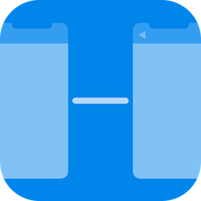
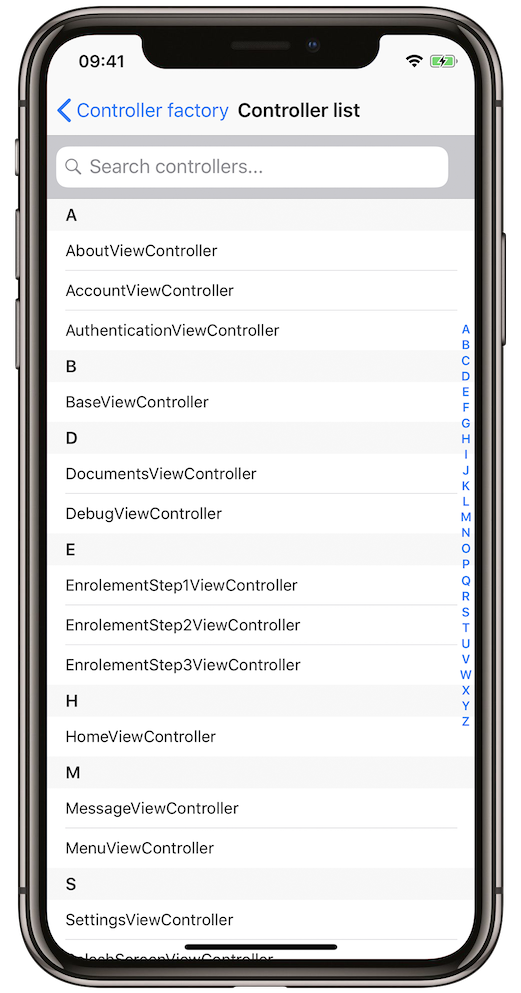
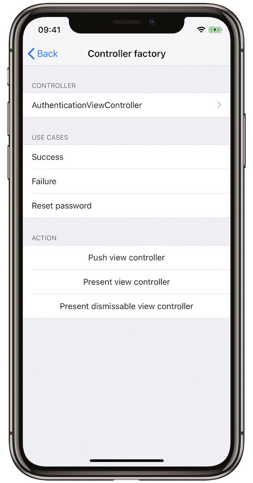

# iOS Controller Factory


[](https://github.com/Carthage/Carthage)



## Purpose of the iOS `ControllerFactory`

Embedding a debug view in your app is a great tool to save a lot of time, but it can also be a tedious one to build. 

ControllerFactory is a framework that aims at easily allowing the instantiation of *any* `UIViewController` from your app, in a way that is as fast and painless as possible.

The framework will leverage the runtime environment to retrieve the complete list of all the view controllers in your app, and let you choose which one you wish to see displayed on screen. Additionally, it also embeds customization options, for instance to provide initial data.

## Requirements
- iOS 8.0+
- Xcode 9.0+
- Swift 4.1+

## Installation

### CocoaPods

Add the following to your `Podfile`:

`pod "ControllerFactory"`

### Carthage

Add the following to your `Cartfile`:

`github "worldline/ControllerFactory"`

## How `ControllerFactory` can help you save time

Let's say you want to adapt your app to make the best use of the gorgeous iPhone X display.

Step 1 - You adapt and test your app's homepage. Check. 

Step 2 - Then you adapt and test your app's settings view controller. Easy. 

But then, you adapt and need to test, for the eleventh time, the third controller of the enrolment process. You need to go through the whole enrolment process, again and again. Maybe you cheat a little, and, why not, create an easy access button on your homepage, which loads this controller directly. This is fine...

But, are you willing to do that for the 35 controllers left? 

No, you are not. This is where ControllerFactory saves the day.

## How does `ControllerFactory` work?

`ControllerFactory` provides you with a debug view that will automatically retrieve and list **all** your view controllers:



Then you just need to select the view controller you want to instantiate, and choose wether you want it pushed or presented modally. 



All your view controllers can now be displayed on screen, with just two taps 👌

## Limitations

For the moment, `ControllerFactory` cannot:

* deal with controllers that are using Swift's Generics, as they cannot be marked `@objc`;
* deal with controllers that are instantiated from a UIStoryboard, without writing some code (see [below](#custom-initializer));
* fetch controllers from multiple bundles at the same time.

## Usage

* [Import](#import)
* [Displaying the debug view](#displaying-the-debug-view)
* [Excluding specific view controllers](#excluding-specific-view-controllers)
* [Setting up initial data](#setting-up-initial-data)
* [Tackling controllers with several use cases](#tackling-controllers-with-several-use-cases)
* [Custom initializer](#custom-initializer)
* [Custom initializer with use cases](#custom-initializer-with-use-cases)

### Import

```objc
// Objective C
@import ControllerFactory;
```

```swift
// Swift
import ControllerFactory
```

### Displaying the debug view

To instantiate the debug view, you can use any of the following methods:

```objc
// Objective C
[ControllerFactory instantiate];
[ControllerFactory instantiateWithBundle:(NSBundle * _Nonnull)];
[ControllerFactory instantiateWithExcludedViewControllers:(NSArray<NSString *> * _Nonnull)];
[ControllerFactory instantiateWithBundle:(NSBundle * _Nonnull) excludedViewControllers:(NSArray<NSString *> * _Nonnull)];
```

```swift
// Swift
ControllerFactory.instantiate()
ControllerFactory.instantiate(bundle: Bundle)
ControllerFactory.instantiate(excludedViewControllers: [String])
ControllerFactory.instantiate(bundle: Bundle, excludedViewControllers: [String])
```

The basic method will show you all the view controllers from your main bundle.

You also have the possibility to specify a different bundle if you need to, and/or exclude some specific view controllers (for instance, abstract classes).

### Excluding specific view controllers

In order to exclude some specific view controllers, first start by printing out to the console the list of all the controllers that were retrieved:

```objc
// Objective C
[ControllerFactory printControllers];
[ControllerFactory printControllersWithBundle:(NSBundle * _Nonnull)];
```

```swift
// Swift
ControllerFactory.printControllers()
ControllerFactory.printControllers(bundle: Bundle)
```

Just as before, the first method will print all the view controllers from your main bundle, while the second one allows you to print all the view controllers from another bundle.

You then need to use the values that were printed in order to populate the `excludedViewControllers` array.

### Setting up initial data

Up to this point, we used the debug view to instantiate controllers using their default initializer. While this works well for simple controllers, it does not allow you to provide some initial data.

To do so, you can implement the following protocol:

```swift
// Swift
@objc public protocol ControllerFactoryCompliant {
    func prepareForControllerFactory()
}
```

The `prepareForControllerFactory()` method will be called after the controller has been instantiated and before the it is displayed, so this is a perfect place to set up some initial data.

### Tackling controllers with several use cases

If your controller implements several use cases, or works with several sets of data, you can hand the them through the protocol `ControllerFactoryCompliant`: 

```swift
// Swift
@objc public protocol ControllerFactoryUseCaseCompliant {
    static func getUseCases() -> [String]
    func prepareForControllerFactory(useCase: String)
}
```

The `getUseCases()` method allows you to list your use cases.

The `prepareForControllerFactory(useCase: String)` method will be called after initialization, so this is where you should set your data or by switch to a particular use case.

The debug view will then present the different use cases, allowing you to select the one you need.

### Custom initializer

If your view controller doesn't make use of the default initializer, trying to instantiate it will cause your app to crash. To resolve the issue, you will need to implement the following protocol: 

```swift
// Swift
@objc public protocol ControllerFactoryInstantiable {
    static func initForControllerFactory() -> UIViewController
}
```

In the `initForControllerFactory()` you can use your custom initializer, set all the required data, and then return the controller.

### Custom initializer with use cases

Finally, if your view controller doesn't make use of the default initializer and depends on different use cases, or different sets of data, you will need to implement the following protocol: 

```swift
// Swift
@objc public protocol ControllerFactoryUseCaseInstantiable {
    static func getUseCases() -> [String]
    static func initForControllerFactory(useCase: String) -> UIViewController
}
```

Just as before, the `getUseCases()` method will allow you to name your different use cases.

In the `initForControllerFactory(useCase: String)` you use your custom initializer to create the controller.

The debug view will then present the different use cases for you to select, before instantiating your view controller.

## Credits

This framework has been put together at [Worldline](https://worldline.com) by [Benoît Caron](https://www.linkedin.com/in/benoît-caron-57530634/) and [Vincent Pradeilles](https://github.com/vincent-pradeilles/).

## License

This framework is provided under the MIT license.
